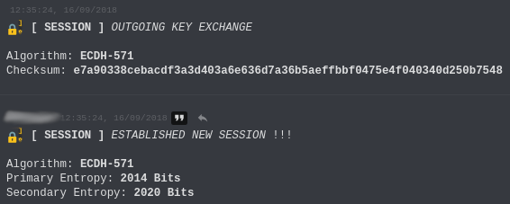
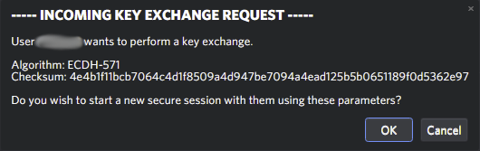

<h1 align="center">
    
    DiscordCrypt™
</h1>

* [**Installation**](#installation)
    * [***Windows***](#windows)
    * [***MacOS***](#macos)
    * [***Linux***](#linux)
    * [**Verifying Signatures**](#verifying-signatures)
* [**Usage**](#usage)
    * [***Creating A New Database***](#creating-a-new-database)
    * [***Changing The Database Password***](#changing-the-database-password)
    * [***Exchanging Keys***](#exchanging-keys)
        * [*Personal Conversations*](#personal-conversations)
        * [*Channels & Group DMs*](#channels-and-group-dms)
            * [*Sharing Existing Passwords*](#sharing-existing-passwords)
    * [***Resetting Or Updating Passwords***](#resetting-or-updating-passwords)
* [**Best Practices**](#best-practices)
* [**Debugging**](#debugging)
* [**Frequently Asked Questions ( FAQs )**](#frequently-asked-questions)
* [**Known Limitations And Bugs**](#known-limitations-and-bugs)
* [**Support And Discussion**](#support-and-discussion)


# Installation

**DiscordCrypt** is installed just like any other 
    [BetterDiscord](https://github.com/rauenzi/BetterDiscordApp/releases) plugin. 
    If you do not have BetterDiscord installed, be sure to do that first before continuing with 
    this guide.

**N.B** For now, the plugin has ***only*** been tested on *Windows* and *Linux* but it 
    should work for all operating systems that support BetterDiscord.

For installation on specific operating systems, see below:

 

#### Windows

* [Download](https://gitlab.com/leogx9r/DiscordCrypt/raw/master/build/discordCrypt.plugin.js?inline=false) 
    the plugin file.
* Save the plugin to the following path: **`%APPDATA%\BetterDiscord\plugins`**.
    * *Example: `C:\Users\Jeremy\AppData\Roaming\BetterDiscord\plugins\discordCrypt.plugin.js`*
* [Verify](#verifying-signatures) the signature is valid.
* **Ensure** the file is named exactly as **`discordCrypt.plugin.js`**.
* Restart Discord by pressing: **`Ctrl + R`**.
* Enable the plugin in BetterDiscord's plugin settings menu.

 

#### MacOS

* [Download](https://gitlab.com/leogx9r/DiscordCrypt/raw/master/build/discordCrypt.plugin.js?inline=false) 
    the plugin file.
* Save the plugin to the following path: **`~/Library/Preferences/BetterDiscord/plugins`**.
    * *Example: `/home/jeremy/Library/Preferences/BetterDiscord/plugins/discordCrypt.plugin.js`*
* **Ensure** the file is named exactly as **`discordCrypt.plugin.js`**.
* Restart Discord by pressing: **`Ctrl + R`**.
* Enable the plugin in BetterDiscord's plugin settings menu.

 

#### Linux

##### Stable & Canary Versions

*The following instructions are for **Discord Stable/Canary***.
( Get it [here](https://discordapp.com/api/download?platform=linux&format=deb) for Debian/Ubuntu. )

The *PTB* or *SNAP* versions are **NOT** supported.

* [Download](https://gitlab.com/leogx9r/DiscordCrypt/raw/master/build/discordCrypt.plugin.js?inline=false) 
    the plugin file.
* Save the plugin to the following path: **`~/.config/BetterDiscord/plugins`**.
    * *Example: `/home/jeremy/.config/BetterDiscord/plugins/discordCrypt.plugin.js`*
* **Ensure** the file is named exactly as **`discordCrypt.plugin.js`**.
* Restart Discord by pressing: **`Ctrl + R`**.
* Enable the plugin in BetterDiscord's plugin settings menu.

##### Flatpak Versions

* [Download](https://gitlab.com/leogx9r/DiscordCrypt/raw/master/build/discordCrypt.plugin.js?inline=false) 
    the plugin file.
* Save the plugin to the following path: **`~/.var/app/com.discordapp.Discord/config/BetterDiscord/plugins`**.
    * *Example: `/home/jeremy/.var/app/com.discordapp.Discord/config/BetterDiscord/plugins/discordCrypt.plugin.js`*
* **Ensure** the file is named exactly as **`discordCrypt.plugin.js`**.
* Restart Discord by pressing: **`Ctrl + R`**.
* Enable the plugin in BetterDiscord's plugin settings menu.
 
 
 
## Verifying Signatures

For every release starting with version 
    [`1.2.4`](https://gitlab.com/leogx9r/DiscordCrypt/tags/v1.2.4), 
    we [sign](https://www.gnupg.org/gph/en/manual/x135.html) the plugin using 
    [GPG](https://en.wikipedia.org/wiki/GNU_Privacy_Guard) for increased security.
 
***You should ALWAYS verify the signature of this plugin before installing it to ensure it has 
    not been maliciously tampered with.***

For Windows and Linux operating systems, we recommend you use 
    [`Kleopatra`](https://www.openpgp.org/software/kleopatra/) for verifying signatures and for 
    MacOS, we recommend [`GnuPG for OS X`](https://gnupg.org/download/index.html).

The signature for each release is located [here](build/discordCrypt.plugin.js.asc). 
    Please read the manual for your specific client to determine how to verify signatures.

If everything goes well, you'll notice output similar to below:

```
$ gpg --verify build/discordCrypt.plugin.js.asc
gpg: assuming signed data in `build/discordCrypt.plugin.js'
gpg: Signature made Fri 1 Jun 2018 00:00:01 AM 00 using RSA key ID 3787CE3F
gpg: Good signature from "DiscordCrypt (DiscordCrypt Signing Key)"
```

The above depends on the client you use but you must always look for a 
    "*Good*", "*OK*" or "*Valid*" signature.

Please note, you will need to import the PGP signing key located [here](build/pgp_signing_key.asc) 
    and **NOT** the binary Ed25519 signature `discordCrypt.plugin.sig.bin` to verify signatures.

Finally, you should manually verify that the signing key you imported above matches the 
    information below:

```
Key ID: 3787CE3F 
Key ID ( Long ): 0xB8EC0775960AEB2E4C11F084DA613E753787CE3F
Fingerprint: B8EC 0775 960A EB2E 4C11 F084 DA61 3E75 3787 CE3F

Key Server: hkp://keys.gnupg.net OR hkp://pgp.mit.edu
UID: DiscordCrypt (DiscordCrypt Signing Key)
Hash: 0xDA613E753787CE3F
```

**N.B.** The plugin self-verifies every update so you only ever need to verify the above PGP signatures once upon your first 
    installation. Updates get verified using an [Ed25519](https://en.wikipedia.org/wiki/EdDSA) signature.
    
The public key for update signature validation is:

```
Hex: 44 6A 93 CE 8D 5D 69 D3 13 18 0E C5 4E EF 29 21 E2 1F 64 A4 DF 20 83 39 05 38 6F B6 FA 53 B7 42
Base64: RGqTzo1dadMTGA7FTu8pIeIfZKTfIIM5BThvtvpTt0I=
```


# Usage

**DiscordCrypt** creates a menu bar upon loading, allowing you to interact with the plugin.

---


---

These icons each offer a different functionality as follows:

* **[1] Upload Encrypted Clipboard**
    * This uploads your current clipboard to the Up1 file service and sends an encrypted link 
        to the file to the current channel.
    * After uploading, this sets your clipboard to the deletion link for the uploaded file which 
        you may use to either manually delete the file after your colleague has downloaded it 
        or for later deletion. To use that deletion link:
        * Use the host `https://share.riseup.net/< deletion link >`
    * You are limited to a maximum of 50 MB. 
* **[2] Upload Encrypted File**
    * This opens the file upload menu that you may use to encrypt and upload a file less than 
        50 MB to an Up1 service.
    * You may choose whether to randomize the file name and whether to attach a deletion link 
        to the message.
    * If sending the deletion link, it will not be in the URL format to avoid accidentally deleting
        the file. To use that deletion link:
        * Use the host `https://share.riseup.net/< deletion link >`
    * You are also able to write a message prior to sending the file which will be sent immediately.
        * Standard message limits apply. Messages longer than the maximum length will be split 
            into multiple messages.
    * Files are encrypted using *AES-256* in [CCM](https://en.wikipedia.org/wiki/CCM_mode) mode 
        as per Up1's protocol.
* **[3] Plugin Settings**
    * This menu controls the settings for the plugin.
    * You can enable and disable each option here.
    * This also contains a database management menu allowing you to import and export your current 
        passwords.
        * Note that exported entries are **NOT ENCRYPTED** and as such should be handled 
            with caution.
    * The ability to restore ignored updates or manually checking for updates may be done within 
        the "**Security Settings**" sub-menu.
* **[4] Enable/Disable Message Encryption**
    * Clicking this button either enables or disables automatic encryption.
    * Automatic encryption will **always** encrypt any message sent
        **as long as passwords are defined** for the current channel.
    * Clicking this button changes the lock icon to an unlock icon indicating messages sent will 
        not be automatically encrypted.
        * Clicking this icon again re-enables automatic encryption and changes the lock icon back 
            to the default seen above.
    * This button is channel specific meaning that when you switch channels, it will use 
        your last setting. By default, automatic message encryption is **disabled**.
* **[5] Password Settings**
    * This menu allows you to set, modify, reset or copy the passwords applied to the 
        current channel being viewed.
    * If you reset the current passwords, they will use the default passwords defined in 
        `Plugin Settings`.
    * Using the `Copy Current Passwords` button to the clipboard for sharing.
* **[6] Passphrase Generator**
    * This allows you to generate a unique passphrase for whatever reason.
    * We recommend you use this when you want to send passwords for a non-DM channel.
    * Passphrases contain roughly _13 bits_ of entropy per word.
    * You should use a passphrase that is at least **10 words** long.
    * Word lists are provided by the 
        [EFF Diceware](https://www.eff.org/files/2016/07/18/eff_large_wordlist.txt) list.
* **[7] Generate & Send New Public Key**
    * This can **ONLY** be used in DMs.
    * This button is used to start or generate a new encrypted session between two users.
    * Once you start a new session with a friend, you can re-generate it at any time.
    * This is further detailed below.

 

### Creating a new database

Every time Discord starts, you will be met with a prompt seen below:

---


---

**DiscordCrypt** uses an AES-256 encrypted database file in 
    [GCM](https://en.wikipedia.org/wiki/Galois/Counter_Mode) mode to store its information and 
    uses a ***master password*** to unlock this file.

The first time you use the plugin, you'll be prompted to input a new password that will 
    be used to create the database.

Every additional time you start or restart Discord, you'll be prompted with the above screen 
    where you must enter the same password as before. If you don't enter the same password,
    you will not be able to unlock your database and decrypt any messages.

All exchanged keys and passwords are saved to this database and **cannot be recovered** 
    if the master password is lost so be sure to use a strong but memorable one. 
    ( [Forgot Password?](#frequently-asked-questions) )

Your password for this database **must meet at least one** of the below requirements.

- Your password MUST contain at least one uppercase & lowercase letter, a number and a symbol 
    and be **at least** 8 characters in length.
    - Example: `p@s$w0rD` ( **PLEASE DO NOT USE SOMETHING THIS.** )
- Your password must be **GREATER THAN 32 characters** in length.
    - Example: `gestation broken directive coveting bony unrevised monogram clapped anchovy unmasking handiness actress`

**N.B. This password is the only thing protecting all others and as such, should be a very 
    strong and unpredictable.**
 

### Changing the database password

If you wish to change your master password, you may do so in the `Plugin Settings` menu.
    (  )

You can only do this however, after you unlock the database with your previous password.

If you [forgot your password](#frequently-asked-questions) then you will need to reset the 
    database.

If you enter a password in the `New Master Database Password` field and save your settings, 
    this key will be used to encrypt the database in the future.


**N.B.** If a key is not entered into this field, it is ignored. Your current password will 
    **NOT** be replaced.

 

### Exchanging Keys


While we give users a choice regarding the options they want to use when originally setting up 
    an encrypted conversation via manually setting passwords, we offer a simple way to do it, 
    while still enforcing strong cryptography methods.

This involves using an 
[asymmetric key exchange](https://en.wikipedia.org/wiki/Diffie%E2%80%93Hellman_key_exchange) 
    algorithm which, while allowing you to send information via an insecure channel, allows a 
    strong secret key to be shared between two parties.


#### Personal Conversations

###### Private Messaging

To start a secure session with another person, they need to have this plugin installed.

After which, you can start a secure session with them using the following steps:

* Generate a key and send a new public key using the Auto-Key-Exchange button. 
    (  )
* If your partner has the `Automatically Accept Key Exchanges` option switched on, they will 
    immediately attempt to establish a session with you..
* If they do not have `Automatically Accept Key Exchanges` enabled, you will need to wait 
    for them to manually accept the exchange.







###### Channels And Group DMs

Exchanging keys for a group conversations or channels is more complex and a generally longer 
    process. You may want to leave your group chat unencrypted if you don't discuss anything 
    sensitive.

* Generate **two** passphrases using the `Generate Secure Passphrase` option. These will 
    be the keys that will be used to encrypt the channel.
* Open up your favorite text editor and take note of the passphrases you generated. 
    Make sure you specify which passphrase will be used as the primary and secondary key.
* Establish a secure session with every member you want to read encrypted messages 
    in the group chat. This step is **mandatory** to avoid compromising security.
* Send these keys to every member that needs them.
* Switch to the group chat and apply both the primary and secondary key using the 
    `Password Settings` menu. This must also be done by every peer you sent these keys to.
* You *may* need to restart the Discord app ( `Ctrl+R` ) after doing this to read old messages.


###### Sharing Existing Passwords

You can sharing existing passwords with other users but it is **highly** ***unrecommended***.
    We recommend you simply generate new keys for the conversation and send these to the user 
    and every other member. This prevents them from being able to read past messages.

* Switch to the group or channel that currently uses encrypted messages.
* Open the `Password Settings` menu. (  )
* Click on `Copy Current Passwords` located at the bottom of the panel.
    * Please note this copies the keys from your current channel in an **UNENCRYPTED** 
        form to your clipboard.
    * **KEEP THEM SAFE AND DO NOT SAVE THEM**.
* Paste your clipboard to your partner **only when you have established a secure session**. 
    ( `Ctrl+V` or `Right Click -> Paste` )

 

### Resetting Or Updating Passwords

You may one day end up in a situation where you need to manually reset or update the 
    password for the current conversation.

One such situation is when sharing keys for group conversations. ( See Above )

**N.B. We recommend against manually creating a password as we offer a tool to securely 
    generate strong passwords for both parties.**

If it comes to this, you simply need to go to the `Password Settings` menu 
    (  ) to apply or reset your passwords for the channel 
    you are currently in.

If you are manually updating the passwords to be able to have an encrypted group 
    conversation, simply paste the "Primary Key" in the first field and the 
    "Secondary Key" in the second field, then press `Save Passwords`.

 

# Best Practices

The following tips should be adhered to for maximum privacy between users.

* Change your master database password frequently.
* **NEVER** share passwords across unencrypted communications. Always establish a secure 
    connection by means of a key exchange before sending passwords.
* Refresh your sessions on frequent basis. This ensures that even if your current 
    session keys are compromised that an attacker will not be able to read any future messages.
* Use large key sizes ( preferably the maximum ) when exchanging keys. For Diffie-Hellman, 
    this is 8192 bits or for Elliptic Curve Diffie-Hellman, this is 521/571 bits. Prefer 
    Post-Quantum exchange algorithms such as **Supersingular Isogeny Diffie-Hellman**.
* Use strong passwords for encrypting your database. Passwords **musst be at least 
    8 characters long and contain a combination of alphanumeric ( ***A-Z***, ***0-9*** ) 
    and symbolic characters or be greater than 32 characters total**.
    * We recommend using a [password manager](https://en.wikipedia.org/wiki/Password_manager) 
        such as [KeePassX](https://www.keepassx.org/)/[KeePassXC](https://keepassxc.org/) or
        [BitWarden](https://bitwarden.com/) to generate and safely store strong passwords 
        though we strongly prefer the KeePass app variants ourselves due to the fact that 
        the database remains completely in the user's control and not in the cloud.
* Use AES as either the primary or secondary ciphers for encryption. AES is a cipher 
    developed in 1998 and is still considered one of the most secure methods of 
    sending and receiving confidential information to this day.
* If you require absolute secrecy which is not vulnerable to Discord's potential 
    MiTM attacks, use the built in passphrase generator, encrypt these using PGP and 
    send them to your partner over a non-Discord channel then manually apply these
    keys after you decrypt them.
* [Assess your risks](https://ssd.eff.org/en/module/assessing-your-risks) and practice 
    [operational security](https://en.wikipedia.org/wiki/Operations_security). Encryption is 
    merely a tool which must be used properly to be effective.
* Look into alternative communication methods. If you don't need to use Discord, **don't**.
    Good alternative messaging apps include [Signal](https://signal.org/), [Wire](https://wire.com/),
    [Riot](https://about.riot.im/) and [Pidgin](https://pidgin.im/) + [OTR](https://otr.cypherpunks.ca/).
* Install the complimentary script [SecureDiscord](scripts/secureDiscord.js) for additional
    protection.
    * Configurable allowing you to choose which options to use.
    * Sets your user agent to [Tor](https://www.torproject.org/)'s.
    * Sets additional HTTP headers to Tor defaults.
    * Blocks access to known Discord tracking URLs.
    * Blocks malicious and tracking based URLs using a block list.
    * Removes tracking from any external URL.
    * Removes several fingerprint based headers from requests.
    * Adds an additional [Do-Not-Track](https://en.wikipedia.org/wiki/Do_Not_Track) header 
        to all your requests.
    * Routes all your traffic through a SOCKS proxy running on your computer.
        - By default, this routes requests over Tor's default address. ( `127.0.0.1:9050` )

 

# Debugging

The official Discord client is built with the [Electron framework](https://electronjs.org) 
    that uses a tweaked Chromium version bundled with [Node.js](https://nodejs.org/en/) 
    support.

The DevTools console interface can be opened using the key combination of: `Ctrl + Shift + I`.

In the event that you encounter an error and wish to submit an issue to us to help 
    resolve this problem, please follow these steps:

* First ensure you disabled all themes and plugins to 
    [avoid possible incompatibilities](https://gitlab.com/leogx9r/DiscordCrypt/issues/5).
* Download and drop the `discordCrypt.plugin.js` into your BetterDiscord Plugins folder.
    Restart Discord afterwards. ( `Ctrl + R` )
* Exactly like on Chromium, you can open the debug console by pressing `Ctrl + Shift + I`.
* Watch your console while using the client as you would normally do. In the the opened 
    debug console window switch to the 'Console' tab and see if there are any errors. 

In case there is an error caused by the plugin, create an issue ticket with the 
    exact debug output. You should, as a general practice of security, strip any 
    identifiable information from your request. If however more information is 
    required than you provided, we'll request it from you.

Be sure to read the [contribution](CONTRIBUTING.md) guidelines before creating an issue.

 

# Frequently Asked Questions

### Isn't Discord already encrypted or private ?

Discord ***claims*** that all its messages are encrypted, and while that 
    **is** true ***to an extent*** as they are sent over an HTTPS connection, 
    it ***does NOT mean that they cannot see the content*** of your messages.

For anyone concerned about or valuing their right to privacy, this is an unfortunate 
    caveat of using Discord. 

Messages sent to your friends or servers are encrypted before they're sent out but 
    are decrypted by Discord's servers.

This means anything you've ever sent, typed, or spoken could have been recorded and 
    logged by Discord's owners.

Various messenger applications ( Signal, Riot etc. ) have taken user's privacy seriously 
    and implemented [end-to-end encryption](https://en.wikipedia.org/wiki/End-to-end_encryption) 
    so that no one, not even the platform's owners, can see what users do.

Discord has declined several suggestions to implement end-to-end encryption in the past and 
    also constantly attempt to control what users can do or say by censoring users or group 
    chats that they otherwise do not agree with.
     
We do not mean to say that hate-speech, racism or other morally wrong topics are okay 
    but rather it violates free-speech when Discord themselves are given the right to choose 
    what can and cannot be said by users.
    
In addition to this, Discord's current CEO, [Jason Citron](https://twitter.com/jasoncitron) 
    previously founded another application quite similar to Discord, 
    [OpenFeint](https://en.wikipedia.org/wiki/OpenFeint) which had been caught harvesting and 
    [illegally selling user data](https://courthousenews.com/gamers-say-openfeint-sold-them-out) 
    to advertisers for profit which has since been shut down shortly after a class-action lawsuit 
    was filed against them.

This also includes the fact
    that their system actively tracks users, their messages which they refuse to delete and 
    generally, have been caught doing sneaky things in the past. See 
    [here](https://tomsguide.com/us/help-me-toms-guide-discord-permissions,review-5104.html).

    The OpenFeint mobile gaming network collected data and personal information from its 
    users’ cellphone-linked profiles and sold the information to Internet application developers, 
    according to a federal class action.
    
    Lead plaintiff Matthew Hines claims Openfeint accessed, monitored and stored the unique 
    device identifiers for mobile devices along with personally identifiable information such 
    as a user’s exact GPS location, Internet browsing history and Facebook and Twitter profiles.
    
    OpenFeint’s business plan included accessing and disclosing personal information without 
    authorization to mobile-device application developers, advertising networks and web-analytic 
    vendors that market mobile applications, according to the complaint. 
    
    The company acquired such information covertly, without adequate notice or consent, 
    involving 100 million consumer mobile devices.

    After accessing one of OpenFeint’s applications, the company bypassed both the technical 
    and code barriers designed to limit unauthorized access, as well as his mobile device’s 
    privacy and security settings, Hines claims.
    
    OpenFeint used the data it collected to collaborate with application developers and create 
    a database that further enabled the tracking scheme and conducted systematic and continuing 
    surveillance of the class members’ mobile-device activity, which continues today.
    
    In spite of this activity, OpenFeint assures customers that its applications are all safe for 
    downloading, according to the suit.
    
For visual proof of this, please see:

* [Initial E2E Request Denied](images/discord-end-to-end-denied.png)
* [Refusal For User Data Deletion](images/discord-refuses-to-delete-user-data.png)
* [Government Requests For User Data](images/discord-requests-for-user-data.png)

We highly disapprove of their ideals as we believe their actions violate every human's 
    right to privacy.

This plugin attempts to implement the behavior of end-to-end encryption behavior so you 
    can actually keep your messages between friends private.

While this plugin does not support, nor plan to support end-to-end voice encryption, 
    messages and uploaded files via the encrypted file uploading interface **should** 
    be safe and secure from prying eyes.


### Why does the plugin's source look so weird?

We recently added bigger libraries to the plugin ( Such as OpenPGP.js ), and as a result, 
    we started compressing the plugin to save everyone a few megabytes of bandwidth every time 
    DiscordCrypt is downloaded.

Having such a large source would increase development complexity. If you wish to have a look at 
    the uncompressed, original source, look at the source file: 
    [src/discordCrypt.plugin.js](src/discordCrypt.plugin.js).


### Why's the UI so unattractive?

Unfortunately, the core project members have never been good CSS designers as we 
    mainly specialize in internal application and system-level programming.

If you however do know how to make an attractive UI, please do create a pull request 
    with your changes!


### How do I send nitro emojis?

To be able to send nitro-emojis, ( animated & emojis from any guild ) you need to join a 
    nitro-only emoji server. After which, once you establish a secure session or group 
    you will be able to select and use these emojis. You can optionally use the message 
    encryption suffix to send the emoji automatically. Example: `:discordCrypt:|ENC`.

Autocomplete and the emoji picker works just as if you're a nitro user **only** if you've 
    established a secure session first.

 

### Can I skip the password prompt?

The screen prompting you to unlock your database is necessary for **DiscordCrypt** to 
    function. Without it, you won't be able to send or receive any encrypted messages.

If you don't want to be bothered to unlock the database every time Discord starts up, you 
    can disable the plugin in BetterDiscord's settings and enable it only when needed.
    

### Why does the plugin have to start on the friends or games tab ?


Due to the way Discord caches messages, any previously parsed message won't be able to be 
    easily edited. This means if you view an encrypted channel before you unlock your database, 
    you will not be able to see any previous messages prior to unlocking it. You will only be 
    able to view messages you send or receive after this is done.

To avoid unnecessarily confusing users due to some messages not being decrypted, 
    we've decided to force the client to reload on the Friends tab if the plugin loads when 
    the client is viewing a channel or DM. 

 

### What do I do if I forgot my Master Password?

You can reset your database ( and thus your configuration ) by deleting the file 
    `DiscordCrypt.config.json` located in the same directory as the plugin that you went to 
    during [installation](#installation).

**Doing this will reset your configuration** and allow you to enter a new password. 
    Be aware that by resetting your configuration, **you will lose the passwords of all of 
    your encrypted conversations** and as such, will be unable to read any previous messages.

As a result, you will need need to perform a new key exchange with your friends. 
    If you're part of an encrypted group/channel conversation, you will need to generate 
    new keys or ask someone to send you the passwords securely.

 

### How do I share passwords with new people?

While we do not recommend sharing passwords with newcomers, and instead suggest you generate 
    new keys whenever that happens, you can copy the passwords of the current channel and 
    share them by following [theses steps](#sharing-existing-passwords).

 

### Why is DiscordCrypt's CPU usage so high?

Unless you're generating keys or performing encrypted file uploads, **DiscordCrypt** should not 
    be resource-heavy.

Discord itself can be annoying in that regard as it generally uses a large amount of resources as 
    all Electron applications [tend to](https://josephg.com/blog/electron-is-flash-for-the-desktop/).


### Why is this so complicated?

Unfortunately, implementing privacy and message encryption in this manner is difficult to do.

We've tried to simplify the process as much as possible but once you get used to it, it becomes 
    much easier.

If you still feel confused or want to know something specific, 
    [join our support server](https://discord.gg/3uakNmM) and we'll try to help you out when we're free.

 

# Known Limitations And Bugs

**DiscordCrypt** is not ( and sadly cannot be ) perfect, the plugin is limited in the number 
    of features it can provide.
 

* ***DiscordCrypt's key exchange is vulnerable to Discord's servers being used for 
    [Man-in-The-Middle attacks](https://en.wikipedia.org/wiki/Man-in-the-middle_attack).***
    * While an attacker would need access to Discord's infrastructure as the data is 
        encrypted in transit using TLS, it is in theory possible for an attacker, 
        the government or Discord's administrators to sit in the middle of the 
        key exchange.
        * We discussed this in greater details in the [TECHNICALITIES.md](TECHNICALITIES.md) file.

* Messages are limited to 1820 characters each.
    * Due to additional costs of encryption and verification, messages at maximum size will 
        only be able to display 1820 characters of text..
        * If your message is longer than this, it will be split and sent in multiple messages.


* Voice channels cannot be secured, so what you verbally say in them could still be recorded by Discord.
    Only text messages and file uploads are end-to-end encrypted. However we still recommend using 
        [PGP](https://en.wikipedia.org/wiki/Pretty_Good_Privacy) to encrypt especially sensitive 
        files before sending them.


* Searching past messages is impossible.
    * Since messages are encrypted and the search feature relies 
        on the ability for Discord's servers to read past messages, the search functionality will 
        always be unavailable.
    * If you require searching, you may send your messages in an unencrypted format by starting  
        them with two hash characters  ( `##` ).
    * Messages also will be sent unencrypted if they begin with the forward-slash ( `/` ) character 
        as these are also used for commands.
 


* Some third-party BetterDiscord plugins may conflict with **DiscordCrypt**.
    * One such example discovered so far is the plugin `OldTitleBar` by DevilBro. This plugin 
        causes **DiscordCrypt**'s icons to be unclickable.
        * We do not plan to fix this, but feel free to contribute if you wish to do so yourself.
        * For a list of known problematic themes and plugins, see
            [here](https://gitlab.com/leogx9r/DiscordCrypt/issues/5).


* Messages cannot be encrypted when using the in-game overlay.
    * This is due to Discord using a separate module to display messages in the overlay that is 
        unrelated to the Desktop app. 

# Support And Discussion

If you've discovered a bug in the plugin, feel free to create an issue after reading the 
    [contribution guide](CONTRIBUTING.md). Please be as detailed as possible when submitting 
    your issues.

We also have a [Discord Server](https://discord.gg/3uakNmM) for any discussion 
    related to **DiscordCrypt** and for general user support.

 
