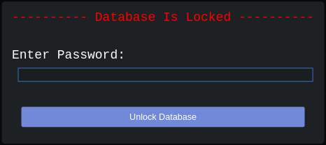
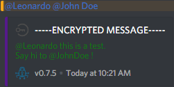

<h1 align="center">
    
    DiscordCrypt
</h1>

* [**Introduction**](#introduction)
* [**Installation**](#installation)
    * [***Windows***](#windows)
    * [***MacOS***](#macos)
    * [***Linux***](#linux)
* [**Usage**](#usage)
    * [***Creating a new database***](#creating-a-new-database)
    * [***Changing the database password***](#changing-the-database-password)
    * [***Exchanging Keys***](#exchanging-keys)
        * [*Personal Conversations*](#personal-conversations)
        * [*Group Conversations / Channels*](#group-conversations-channels)
            * [*Alternative Method*](#alternative-method)
    * [***Resetting / Updating Conversation Passwords Manually***](#resetting-updating-conversation-passwords-manually)
* [**Best Practices**](#best-practices)
* [**Debugging**](#debugging)
* [**Frequently Asked Questions ( FAQs )**](#frequently-asked-questions-faqs-)
* [**Known Limitations**](#known-limitations-bugs)
* [**Support & Discussion**](#support-discussion)

 

# Introduction

**DiscordCrypt** is a plugin for Discord that uses BetterDiscord's internal structure to send and receive encrypted 
messages between users and channels in a safe and secure manner.

It achieves this by using [multiple levels of encryption](https://en.wikipedia.org/wiki/Multiple_encryption) using well known ciphers to ensure only the people you want to read 
your messages can read them and no one else.

The source code is public and licensed under the [**MIT License**](LICENSE) so feel free to have a look or modify it 
as you see fit!

If you'd like an in-depth explanation of its inner workings, [click here](TECHNICALITIES.md).

Contributions are welcome! Be sure to read [our guidelines](CONTRIBUTING.md) before submitting your changes.

Also, while this project is licensed under the MIT, if you feel generous and wish to buy us coffee, We'll happily 
accept.

| **Name**               | **Address**                                                                                        |
| ---------------------- | -------------------------------------------------------------------------------------------------- |
| Bitcoin ( `BTC` )      | `1NYCgcr6JXkX5TZUJcjQYJmeuPxBQ48tTo`                                                               |
| Bitcoin Cash ( `BCH` ) | `qrscw5y3h478whz2zd6fluacmadmkrdca5zghfsw23`                                                       |
| Ethereum ( `ETH` )     | `0x36e89B89f565C6F5E36988Ee5B7DC00cC4Bfda31`                                                       |
| Monero ( `XMR` )       | `83h2PKvpjx9dDK1VJ5B2h8ADbZZUcfEbwaQqqve8nmWv3VyvY7tNv5FLa3dUPwybJGZoGWCz5UDjfDYmKttQmChV2Wv9uiq`  |

 

# Installation

**DiscordCrypt** is installed just like any other [BetterDiscord](https://github.com/Jiiks/BetterDiscordApp) plugin. 
If you do not have BetterDiscord installed, be sure to do that first.

**N.B** For now, the plugin has ***only*** been tested on *Windows* and *Linux* but it should work for all operating 
systems that support BetterDiscord.

For specific operating systems, see below:

#### Windows

* [Download](https://gitlab.com/leogx9r/DiscordCrypt/raw/master/src/discordCrypt.plugin.js) the plugin file. ( Right 
Click -> Save As )
* Save the plugin to the following path: `%APPDATA%\BetterDiscord\plugins`.
	* *Example: `C:\Users\Jeremy\AppData\Local\BetterDiscord\plugins\discordCrypt.plugin.js`*
* **Ensure** the file is named exactly as `discordCrypt.plugin.js`.
* Restart Discord by pressing: **`Ctrl + R`**.
* Enable the plugin in BetterDiscord's plugin settings menu.

#### MacOS

* [Download](https://gitlab.com/leogx9r/DiscordCrypt/raw/master/src/discordCrypt.plugin.js) the plugin file. ( Right 
Click -> Save As )
* Save the plugin to the following path: `~/Library/Preferences/BetterDiscord/plugins`.
	* *Example: `/home/jeremy/Library/Preferences/BetterDiscord/plugins/discordCrypt.plugin.js`*
* **Ensure** the file is named exactly as `discordCrypt.plugin.js`.
* Restart Discord by pressing: **`Ctrl + R`**.
* Enable the plugin in BetterDiscord's plugin settings menu.

#### Linux

*The following instructions are for **Discord Stable***. ( Get it [here](https://discordapp.com/api/download?platform=linux&format=deb) for Debian/Ubuntu. )

The *PTB* and *Canary* versions have **NOT** been tested.

* [Download](https://gitlab.com/leogx9r/DiscordCrypt/raw/master/src/discordCrypt.plugin.js) the plugin file. ( Right 
Click -> Save As )
* Save the plugin to the following path: `~/.config/BetterDiscord/plugins`.
	* *Example: `/home/jeremy/.config/BetterDiscord/plugins/discordCrypt.plugin.js`*
* **Ensure** the file is named exactly as `discordCrypt.plugin.js`.
* Restart Discord by pressing: **`Ctrl + R`**.
* Enable the plugin in BetterDiscord's plugin settings menu.

 

# Usage

### Creating a new database

Every time Discord starts, you will be met with an overlayed prompt seen below:

---

---

**DiscordCrypt** uses an AES-256 encrypted database file to store its information and uses a ***master password*** to
 unlock this file.

The first time you use the plugin, you'll be prompted to input a new password that will be used to create the database.

Every time you restart Discord, you'll be prompted with this screen where you must enter the same password as before.

All exchanged keys and passwords are saved to this database and **cannot be recovered** if the master password is 
lost. ( [Forgot Password?](#i-forgot-my-master-password-what-do-i-do-) )

 

### Changing the database password

If you wish to change your master password, you may do so in the `DiscordCrypt Settings` menu. 

If you enter a password in this field and save your settings, this key will be used to encrypt the database in the 
future.

**N.B.** If a key is not entered into this field, it is ignored. Your current password will **NOT** be replaced.

 

### Exchanging Keys

While we give users a choice regarding the options they want to use when originally setting up an encrypted 
conversation, we offer a simple way to do it, using strong cryptography.

This involves using an asymmetric key exchange algorithm which, while allowing you to post information on an insecure
 channel, allows a strong secret to be shared between parties.

Advanced users are free to mess with the configuration, though be aware that we will only discuss the built-in key 
exchange feature in this tutorial.

#### _Personal Conversations_

* Go in the channel or conversation you want to set a password for.
* If you're not sure whether you've sent a key before, go to the `Key Exchange` menu  
and then to the `Key Generation` tab.
	* If both fields are empty, exit the Key Exchange menu by pressing the `[X]` on the top right 
	.
	* If both fields are full of numbers and letters, clicks the `Clear` button, then exit the menu.
* If you're initiating the key exchange, click on `Generate & Send New Public Key`  
and wait until a public key [is sent in the chat](images/public-key-message.png).
* If your friend is initiating the key exchange, simply wait until you see his key appear in the chat, then click 
`Perform Key Exchange`.
	* If you've initiated the exchange, you also need to click this button after your friend has ( automatically ) 
	shared their key.
* Once this is done, you should see a window pop up after a few seconds, with a progress bar at the bottom.
* Wait until both passwords are generated, then click `Apply Generated Passwords`.

Voila, your conversation will now be encrypted using keys you've just created.

#### _Group Conversations / Channels_

Exchanging keys for a group conversation or a channel is a bit more complex and longer.

You may want to leave your group chat unencrypted if you don't discuss anything sensitive.

The process, however, is quite similar to generating keys for a personal conversation.

* First you must decide who in the group will generate keys with you. 
* Then, you must follow the same steps as if you were generating passwords for a personal conversation, except you 
need to stop before clicking `Apply Generated Passwords`.
* Once you've generated both passwords, you need to copy them using the `Copy Keys & Nuke` button.
* Open up notepad or your preferred text editor and paste the passwords for later use.
* As you should only share the passwords securely, you need to exchange keys with every members of the channel/group.
	* This means you must create an encrypted, 1-on-1 conversation with every members and share the passwords.
* Once you've created a secure channel with every members, individually, you can send the passwords in an encrypted 
message. 
* After the passwords have been shared ( securely ), every user must manually set the passwords for the channel (more
 on that bellow).

###### _Alternative Method_

There is an alternative process for sharing existing passwords with users but it is **highly** ***unrecommended***.

* Switch to the group or channel that currently uses encrypted messages.
* Open the `Password Settings` menu. (  )
* Click on `Copy Current Passwords` located at the bottom of the panel.
    * Please note this copies the keys from your current channel in an UNENCRYPTED form to your clipboard.
* Paste your clipboard to your partner over an encrypted channel. ( `Ctrl+V` or `Right Click -> Paste` )

 

### Resetting / Updating Conversation Passwords Manually

You may one day end up in a situation where you need to manually reset or update the password for the current 
conversation.

**We recommend against manually creating a password as we offer a tool to securely generate strong passwords for both
 parties.**

If it comes to this, you simply need to go to the `Password Settings` menu  to apply 
your passwords.

If you are manually updating the passwords to be able to have an encrypted group conversation, simply paste the 
"Primary Key" in the first field and the "Secondary Key" in the second field, then press `Save Password`.

# Best Practices

The following tips should be adhered to for maximium privacy between users.

* Change your master database password frequently.
* Do **NOT** share passwords across unencrypted communications. Always establish a secure connection before sending 
passwords.
* Change your message keys on a frequent basis. This ensures that even if your current key is compromised that an 
attacker will not be able to read any future messages.
* Use large key sizes ( preferably the maximum ) when exchanging keys. For Diffie-Hellman, this is 8192 bits or for 
Elliptic Curve Diffie-Hellman, this is 521/571 bits.
* Use strong passwords for encrypting your database. Passwords should be at least 8 characters long and contain a 
combination of alphanumeric ( ***A-Z***, ***0-9*** ) and symbolic characters.
    * We recommend using a [password manager](https://en.wikipedia.org/wiki/Password_manager) such as 
    KeePass/KeePassXC, OnePass or LastPass to generate and safely store strong passwords.
* Use AES as either the primary or secondary ciphers for encryption. AES is a cipher developed in 1998 and is still 
considered one of the most secure methods of sending and receiving confidential information to this day.
* If you require absolute secrecy which is not vulnerable to MiTM attacks, use a strong password generator, encrypt 
these using PGP and send them to your partner over a non-Discord channel.

# Debugging

The official Discord client is built with the [Electron framework](https://electronjs.org) that uses  
[Node.js](https://nodejs.org/en/) and a tweaked Chromium version.
The DevTools interface can be opened using the key combination of: `Ctrl + Shift + I`.

In the event that you encounter an error and wish to submit an issue to us to help resolve this problem,
 please follow these steps:

* First ensure you disabled all Themes and Plugins to 
[avoid possible incompatibilities](https://gitlab.com/leogx9r/DiscordCrypt/issues/5).
* Download and drop the `discordCrypt.plugin.js` into your BetterDiscord Plugins folder. Restart Discord afterwards. 
( `Ctrl + R` )
* Same like on Chromium you can open the debug console by pressing `Ctrl + Shift + I`.
* Watch your console while using the client as you would normally do. In the the opened debug console window switch 
to the 'Console' tab and see if there are any errors. 

In case there is an error critical warning create an issue ticket with the exact debug output. You should, as a form 
of security, strip any identifiable information from your request. If however more information is required, we'll 
request it from you.

# Frequently Asked Questions ( FAQs )

### But why ? Isn't Discord already encrypted ?

Discord ***claims*** that all its messages are encrypted, and while that **is** true ***to an extent*** as they are 
sent over an HTTPS connection, it ***does NOT mean that they cannot see the content*** of your messages.

For anyone concerned about or valuing their right to privacy, this is an unfortunate caveat of using Discord. 

Messages sent to your friends or servers are encrypted before they're sent out but are decrypted by Discord's servers.

This means anything you've ever sent, typed, or spoken could have been recorded and logged by Discord's owners.

Various messenger applications ( Signal, Riot etc. ) have taken user's privacy seriously and implemented 
[end-to-end encryption](https://en.wikipedia.org/wiki/End-to-end_encryption) so that no one, not even the platform's 
owners, can see what users do.

Discord has declined several suggestions to implement end-to-end encryption in the past and also constantly attempt 
to control what users can do or say.

We highly disapprove of their ideals as we believe their actions violate every human's right to privacy.

This plugin attempts to emulate the behavior of end-to-end encryption behavior so you can actually keep your messages
 between friends private.

While this plugin does not support, nor plan to support end-to-end voice encryption, messages **should** be safe and 
secure from prying eyes.

 

### The UI is clunky/unattractive. Why not make it better?

Unfortunately, the core project members have never been good CSS designers as we mainly specialize in internal 
application programming.

If you however do know how to make an attractive UI, please do create a pull request with your changes!

 

### How do I tag users?

As we explained in the [Known Limitations](#known-limitations-bugs), tagging users should normally not work because 
of the embeds.

We created a workaround for this allowing you to notify whoever you want while benefiting from the encryption.

The idea behind this is simple: When you tag users in a message, **DiscordCrypt** will extract the usernames and send
 them in an unencrypted message.

Then, it will trim the discriminator and send the message as is, encrypted. That way you can send notifications while
 leaving the username(s) in the message as to not lose context.

***Be aware that the mentions will display a user's "nickname" on the server, while the embed will retain the 
original name.***

Here's how it looks like:

 

### The startup screen is annoying! How can I skip it?!

The screen prompting you to unlock your database is necessary for **DiscordCrypt** to function. Without it, you won't
 be able to send or receive any encrypted messages.

If you wish to stop seeing it, you will simply have to disable the plugin optionally, click the `Cancel` button to 
bypass this prompt.

 

### I forgot my master password. What do I do ?

You can reset your database ( and thus your configuration ) by deleting the file `DiscordCrypt.config.json` located 
in the same directory as the plugin that you went to during [installation](#installation).

Doing this will reset your configuration and allow you to enter a new password. Be aware that by resetting your 
configuration, you will lose the passwords of all of your encrypted conversations.

As a result, you will need need to perform a new key exchange with your friends. If you're part of an encrypted 
group/channel conversation, you will need to generate new keys or ask someone to send your the passwords securely.

 

### We invited a new person in our conversation, how do we give him the passwords?

While we do not recommend sharing passwords with newcomers, and instead suggest you generate new keys whenever that 
happens, you can copy the passwords of the current channel and share them by following 
[theses steps](#alternative-method).

 

### DiscordCrypt uses so much CPU, what gives?!

Unless you're generating keys, **DiscordCrypt** shouldn't be CPU heavy. Discord itself can be annoying in that regard.

If you believe it is causing issues, you may want to try increasing the `Encryption Scanning Frequency` in the plugin
 settings.

 

### This is too complicated to use!

Unfortunately, implementing privacy and message encryption in this manner is difficult to do.

We've tried to simplify the process as much as possible but once you get used to it, it becomes much easier.

 

### Why use embedded messages ?

We wanted a way for users who both use and do not use the plugin to easily identify encrypted messages.

In addition to this, rich embeds provide a nicer means of conveying and formatting the messages that standard 
messages do not.

 

# Known Limitations / Bugs

**DiscordCrypt** is not ( and sadly cannot be ) perfect, the plugin is limited in the number of features it can provide.

Some of **DiscordCrypt**'s limitations are due to the fact that we use embeds to send encrypted messages.

 

* ***DiscordCrypt's key exchange is vulnerable to 
[Man-in-The-Middle attacks](https://en.wikipedia.org/wiki/Man-in-the-middle_attack).***
    * While an attacker would need access to Discord's infrastructure as the data is encrypted in transit using TLS, 
    it is in theory possible for someone to sit in the middle of the key exchange.
        * We discussed this in greater details in the [TECHNICALITIES.md](TECHNICALITIES.md) file.

 

* Only text channels are end-to-end encrypted. Voice channels cannot be secured, so what you verbally say in them 
could still be recorded by Discord.
    * This also means files ( pictures, audio, text files, etc ) are unencrypted as well. We recommend using 
    [PGP](https://en.wikipedia.org/wiki/Pretty_Good_Privacy) to encrypt sensitive files before sending them.

 

* Emojis are not visible in an encrypted message: As we use embeds, sending emojis in a message will result in them 
not being visible.
    * As a workaround for this, messages starting with the character `:` will be sent unencrypted. This means you can
     send your message, then an emoji in a second, unencrypted message.

 

* Emojis don't work when using encryption.
    * As a bypass to this, messages starting with `:` ( Emoji identifier ) will not be encrypted.
    * This will also happen if your messages start with `#` ( For convenience, to quickly send an unencrypted message
    . ) or `/` ( Commands )

 

* Tagging users works in a different way when using encryption:
    * As we use embeds, tagging users in a message should result in them not being notified.
        * To fix this, every users tagged in a message will receive an unencrypted notification.
        [Example here](#how-do-i-tag-users).

 

* Some third-party plugins may conflict with **DiscordCrypt**.
    * One such example discovered so far is the plugin `OldTitleBar` by DevilBro. This plugin causes 
    **DiscordCrypt**'s icons to be unclickable.
       * We do not plan to fix this, but feel free to contribute if you wish to do so yourself.

 

# Support & Discussion

If you've discovered a bug in the plugin, feel free to create an issue after reading the 
[contribution guide](CONTRIBUTING.md). Please be as detailed as possible.

We also have a [Discord Server](https://discord.gg/3uakNmM) for any discussion related to **DiscordCrypt** and for 
general support.
