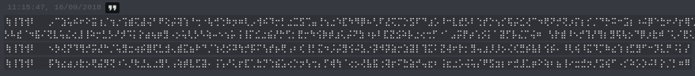
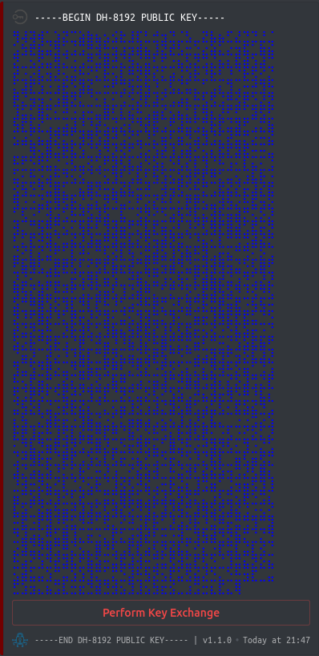

<h1 align="center">
    
    DiscordCrypt
    <h3>End-To-End Message Encryption For Discord</h3>
    <h5>Technical Details Overview</h5>
</h1>


* [**Supported Algorithms**](#supported-algorithms)
    * [***Ciphers***](#ciphers)
        * [*Cipher Modes*](#cipher-modes)
        * [*Message Padding*](#message-padding)
    * [***Key Exchanges***](#key-exchanges)
        * [*Diffie-Hellman*](#diffie-hellman)
        * [*Elliptic Curve Diffie-Hellman*](#elliptic-curve-diffie-hellman)
* [**Message Format**](#message-format)
    * [***Meta-Data Encoding***](#meta-data-encoding)
    * [***User Message Format***](#user-message-format)
        * [*Message Authentication*](#user-message-authentication)
    * [***Public Key Format***](#public-key-format)
    * [***Byte Encoding***](#byte-encoding)
* [**General Encryption & Decryption Process**](#general-encryption-and-decryption-process)
* [**Master Database Encryption**](#master-database-encryption)
* [**Key Exchange Process**](#key-exchange-process)
* [**Known Vulnerabilities**](#known-vulnerabilities)

# Supported Algorithms

**DiscordCrypt** uses a variety of symmetric encryption algorithms exposed via 
[NodeJS](https://en.wikipedia.org/wiki/Node.js)'s [`crypto`](https://nodejs.org/api/crypto.html) module.

In addition to these, two types of key exchanges are supported as well as the ability to generate 
[secure pseudorandom numbers](https://nodejs.org/api/crypto.html#crypto_crypto_randombytes_size_callback) 
which is also exposed by NodeJS.

Every algorithm used in this plugin is directly provided by NodeJS. The only things manually implemented are:

* [Cipher Padding Modes](#message-padding)
* [Scrypt Hashing Algorithm](https://en.wikipedia.org/wiki/Scrypt)

#### Ciphers

The following ciphers are currently supported by **DiscordCrypt**.

 * [Camellia-256](https://en.wikipedia.org/wiki/Camellia_(cipher)) ( **Default Primary Cipher** )
 * [AES-256 ( Rijndael )](https://en.wikipedia.org/wiki/Advanced_Encryption_Standard) ( **Default Secondary Cipher** )
 * [TripleDES-192](https://en.wikipedia.org/wiki/Triple_DES)
 * [IDEA-128](https://en.wikipedia.org/wiki/International_Data_Encryption_Algorithm)
 * [Blowfish-512](https://en.wikipedia.org/wiki/Blowfish_(cipher))

##### Cipher Modes

Each cipher can operate in a number of 
[block operation modes](https://en.wikipedia.org/wiki/Block_cipher_mode_of_operation).

The supported modes are:

- [Cipher Block Chaining](https://en.wikipedia.org/wiki/Block_cipher_mode_of_operation#Cipher_Block_Chaining_(CBC)) 
    ( **Default Block Mode** )
- [Cipher Feedback Mode](https://en.wikipedia.org/wiki/Block_cipher_mode_of_operation#Cipher_Feedback_(CFB))
- [Output Feedback Mode](https://en.wikipedia.org/wiki/Block_cipher_mode_of_operation#Output_Feedback_(OFB))

##### Message Padding

For each cipher, messages must be [cryptographically padded](https://en.wikipedia.org/wiki/Padding_(cryptography)) 
to meet the cipher's block size.

***While NodeJS supports some padding schemes, most are not. As such, these were manually implemented in the code.***

The following padding schemes are supported:

* [PKCS #5/PKCS #7](https://en.wikipedia.org/wiki/Padding_(cryptography)#PKCS7) ( **Default Padding Scheme** )
* [ANSI x9.23](https://en.wikipedia.org/wiki/Padding_(cryptography)#ANSI_X.923)
* [ISO 10126](https://en.wikipedia.org/wiki/Padding_(cryptography)#ISO_10126)
* [ISO 97971](https://en.wikipedia.org/wiki/Padding_(cryptography)#ISO/IEC_7816-4)

#### Key Exchanges

The following algorithms are used to exchange keys in a secure manner.

* [Diffie-Hellman ( ***DH*** )](https://en.wikipedia.org/wiki/Diffie%E2%80%93Hellman_key_exchange) 
    ( **Default Exchange Algorithm** )
* [Elliptic Curve Diffie-Hellman ( ***ECDH*** )](https://en.wikipedia.org/wiki/Elliptic-curve_Diffie%E2%80%93Hellman)

##### Diffie-Hellman

> **Diffie–Hellman key exchange** (**DH**)[[1]](https://en.wikipedia.org/wiki/Diffie%E2%80%93Hellman_key_exchange#cite_note-1) is a method of
    securely exchanging [cryptographic keys](https://en.wikipedia.org/wiki/Key_(cryptography)) over a public channel and was one of the first
    [public-key protocols](https://en.wikipedia.org/wiki/Public-key_cryptography) as originally conceptualized by
    [Ralph Merkle](https://en.wikipedia.org/wiki/Ralph_Merkle "Ralph Merkle") and named after
    [Whitfield Diffie](https://en.wikipedia.org/wiki/Whitfield_Diffie "Whitfield Diffie") and
    [Martin Hellman](https://en.wikipedia.org/wiki/Martin_Hellman "Martin Hellman").

This exchange algorithm supports a large number of key sizes and operates on a similar principle of RSA, the 
asymmetric encryption algorithm.

The main advantage of this algorithm is it is generally considered secure but its downside is as the key size increases, 
the time taken to generate a key pair increases proportionately.

One should generally choose the largest key size when exchanging keys for maximum privacy at the expense of speed.

The following key sizes in bits are supported:

* 768  Bits ( modp1  )
* 1024 Bits ( modp2  )
* 1536 Bits ( modp5  )
* 2048 Bits ( modp14 ) `[ Generally considered secure ]`
* 3072 Bits ( modp15 )
* 4096 Bits ( modp16 )
* 6144 Bits ( modp17 )
* 8192 Bits ( modp18 ) ( **Default Key Size** ) `[ Most Secure ]`

##### Elliptic Curve Diffie-Hellman

> **Elliptic-curve Diffie–Hellman** (**ECDH**) is an anonymous [key agreement](https://en.wikipedia.org/wiki/Key_agreement) 
    protocol that allows two parties, each having an elliptic-curve public–private key pair, to establish a 
    [shared secret](https://en.wikipedia.org/wiki/Shared_secret) over an 
    [insecure channel](https://en.wikipedia.org/wiki/Insecure_channel).
    [[1]](https://en.wikipedia.org/wiki/Elliptic-curve_Diffie%E2%80%93Hellman#cite_note-1) 
    [[2]](https://en.wikipedia.org/wiki/Elliptic-curve_Diffie%E2%80%93Hellman#cite_note-2) 
    [[3]](https://en.wikipedia.org/wiki/Elliptic-curve_Diffie%E2%80%93Hellman#cite_note-3)

>   This shared secret may be directly used as a key, or to [derive another key](https://en.wikipedia.org/wiki/Key_derivation_function).

>   The key, or the derived key, can then be used to encrypt subsequent communications using a 
[symmetric-key cipher](https://en.wikipedia.org/wiki/Symmetric-key_algorithm).

>   It is a variant of the [Diffie–Hellman](https://en.wikipedia.org/wiki/Diffie%E2%80%93Hellman_key_exchange) protocol using 
[elliptic-curve cryptography](https://en.wikipedia.org/wiki/Elliptic-curve_cryptography).

This operates on the same principle of a Diffie-Hellman exchange except it is done using Elliptic Curves.

The main benefits of this algorithm is that it is much smaller in size in contrast to standard Diffie-Hellman keys and 
is extremely quick to generate a key pair.

The downside, however, is that many consider it insecure as concerns of various 
[backdoors](https://en.wikipedia.org/wiki/Elliptic-curve_cryptography#Backdoors) have been brought forth.

Just as with Diffie-Hellman, one should choose the largest key size for key exchanges as the security of the key size is equivilent to a
Diffie-Hellman keys with a much faster generation speed. 

The following key sizes in bits are supported:

* 224 Bits ( `secp224k1` )
* 256 Bits ( `secp256k1` ) `[ Generally considered secure ]`
* 384 Bits ( `secp384r1` )
* 409 Bits ( `sect409r1` )
* 521 Bits ( `secp521r1` ) `[ Most Secure ]`
* 571 Bits ( `sect571k1` ) `[ Considered secure by many but not widely used ]`

## Message Format

A message can consist in two forms.

- User Encrypted Message
- Public Key Message

Each message can be determined by the first 4 characters which is a unique magic string indicating 
its type.


| **Type**             | **Magic**   |
| -------------------- | ----------- |
| `User Message`       | `⢷⢸⢹⢺`      |
| `Public Key Message` | `⢻⢼⢽⢾`      |

### Meta Data Encoding

Each user message contains 4 characters of [encoded](#byte-encoding) metadata.

These decode to a 32-bit integer encoded in Little-Endian order whose byte positions indicates the data type.


| **Byte Position** | **Description**                                                                   |
| ----------------- | --------------------------------------------------------------------------------- |
| `0`               | Details symmetric ciphers used to encrypt the message.                            |
| `1`               | Indicates the block operation mode of the symmetric cipher.                       |
| `2`               | Contains the padding scheme used to align the message to the cipher's block size. |
| `3`               | Contains a random byte. ( `Reserved For Future Use` )                             |

### User Message Format

A user message is expressed in the following format:

**N.B** Character size refers to the UTF-16 character position of a [byte encoded](#byte-encoding) message.


| **Character Size** | **Field**    | **Description**                                               |
| ------------------ | ------------ | ------------------------------------------------------------- |
| `4`                | Magic        | Indicates an encrypted message.                               |
| `4`                | Metadata     | Details the message format. See [here](#meta-data-encoding).  |
| `< Variable >`     | Message      | Contains the encrypted ciphertext.                            |

#### User Message Authentication

All user messages contain a [HMAC](https://en.wikipedia.org/wiki/HMAC) tag prepended to it.

This HMAC uses SHA-256 along with the primary message key to form a hash of the outer ciphertext of the message.

This is prepended such that the variable length message now follows the following format:


| **Byte Position**  | **Byte Size**    | **Description**                                               |
| ------------------ | ---------------- | ------------------------------------------------------------- |
| `0`                | `32`             | Contains the 256-bit HMAC tag of the ciphertext.              |
| `32`               | `Variable`       | Contains the ciphertext ( Including a unique 64-bit salt ).   |


This tag is used for authentication to ensure ciphertexts have not been tampered with during transit.

In addition to this, during verification, they are compared in a time-safe manner to prevent possible forms of 
[timing attacks](https://en.wikipedia.org/wiki/Timing_attack) even though they're not required in this use case.

### Public Key Format

In contrast to a [user message](#user-message-format), a public key message is expressed as follows:


| **Character Size** | **Field**        | **Description**                                  |
| ------------------ | ---------------- | ------------------------------------------------ |
| `4`                | Magic            | Indicates an encrypted message.                  |
| `1`                | Algorithm Type   | Indicates the algorithm and bit size of the key. |
| `1`                | Salt Length      | Indicates the length of the user salt.           |
| `< Variable >`     | User Salt        | A randomly generated series of bytes.            |
| `< Variable >`     | Public Key       | Contains the raw public key.                     |

### Byte Encoding

While all messages are Base64 or hex encoded, Discord does not use a monospace font. This allows 
messages to look uneven when sent.

To combat this, a simple method of substitution is used to replace all characters 
in their hex-based representation with a 256-character monospace-type width using the 
[Braille character set](https://en.wikipedia.org/wiki/Braille_Patterns).

Discord itself treats both UTF-8 and UTF-16 characters as the same length ( character-limit-wise ) 
meaning both a UTF-8 and UTF-16 messages are limited to 2000 characters each.

This is handled by the methods `substituteMessage`, `metaDataEncode` and `metaDataDecode`.

These methods do a 1-1 substitution as follows:


| **Character Set** | **String**                                                                                      |
| ----------------- | --------------------------------------------- |
| `Base 64`           | `000102030405060708` ... `F8F9FAFBFCFDFEFF` |
| `Braille`           | `⠀⠁⠂⠃⠄⠅⠆⠇` ... `⣸⣹⣺⣻⣼⣽⣾⣿`                |

The raw code for this is defined in the `getBraille()` function seen below.

```javascript
return Array.from(
    "⠀⠁⠂⠃⠄⠅⠆⠇⠈⠉⠊⠋⠌⠍⠎⠏⠐⠑⠒⠓⠔⠕⠖⠗⠘⠙⠚⠛⠜⠝⠞⠟⠠⠡⠢⠣⠤⠥⠦⠧⠨⠩⠪⠫⠬⠭⠮⠯⠰⠱⠲⠳⠴⠵⠶⠷⠸⠹⠺⠻⠼⠽⠾⠿⡀⡁⡂⡃⡄⡅⡆⡇⡈⡉⡊⡋⡌⡍⡎⡏⡐⡑⡒⡓⡔⡕⡖" +
    "⡗⡘⡙⡚⡛⡜⡝⡞⡟⡠⡡⡢⡣⡤⡥⡦⡧⡨⡩⡪⡫⡬⡭⡮⡯⡰⡱⡲⡳⡴⡵⡶⡷⡸⡹⡺⡻⡼⡽⡾⡿⢀⢁⢂⢃⢄⢅⢆⢇⢈⢉⢊⢋⢌⢍⢎⢏⢐⢑⢒⢓⢔⢕⢖⢗⢘⢙⢚⢛⢜⢝⢞⢟⢠⢡⢢⢣⢤⢥⢦⢧⢨⢩⢪⢫⢬⢭" +
    "⢮⢯⢰⢱⢲⢳⢴⢵⢶⢷⢸⢹⢺⢻⢼⢽⢾⢿⣀⣁⣂⣃⣄⣅⣆⣇⣈⣉⣊⣋⣌⣍⣎⣏⣐⣑⣒⣓⣔⣕⣖⣗⣘⣙⣚⣛⣜⣝⣞⣟⣠⣡⣢⣣⣤⣥⣦⣧⣨⣩⣪⣫⣬⣭⣮⣯⣰⣱⣲⣳⣴⣵⣶⣷⣸⣹⣺⣻⣼⣽⣾⣿"
);
```

## General Encryption And Decryption Process

Encryption and decryption follows [OpenSSL](https://en.wikipedia.org/wiki/OpenSSL)'s method of deriving keys.

A random 64-bit salt is generated and is used in conjunction with an SHA-256 based PBKDF over 1000 rounds to generate a 
unique [Initialization Vector](https://en.wikipedia.org/wiki/Initialization_vector) and a derived encryption key.

This is used to prevent the same message being encrypted multiple times over the course of a conversation from having 
the same ciphertext being produced.

Messages encrypted in this format take the form:


| **Byte Position**  | **Byte Size**    | **Description**                                               |
| ------------------ | ---------------- | ------------------------------------------------------------- |
| `0`                | `8`              | Contains a one time salt used to generate a unique key.       |
| `8`                | `Variable`       | Contains the ciphertext.                                      |

When a message is being decrypted, the [metadata](#meta-data-encoding) for the message is read to determine how  to 
proceed.

This indicates:

- The symmetric ciphers used.
- The block operation mode of the ciphers.
- The padding scheme used for the message.

All inputs passed to a `< cipher >_decrypt` method is assumed to contain a 64-bit seed used to derive the key and IV.

The plugin employs what is known as [multiple encryption](https://en.wikipedia.org/wiki/Multiple_encryption) to 
encrypt all messages before they are sent.

For this, two ciphers are used. The primary cipher is used to encrypt the 
[plaintext](https://en.wikipedia.org/wiki/Plaintext) message into 
[ciphertext](https://en.wikipedia.org/wiki/Ciphertext).

Following this, the secondary cipher is used along with a completely different key to encrypt the ciphertext yet 
again yielding the final ciphertext. Finally, a HMAC hash using SHA-256 is computed on the final ciphertext and 
is prepended to it creating the final result.

This result is then encoded to [base 64](https://en.wikipedia.org/wiki/Base64) and undergoes 
[byte encoding](#byte-encoding) to produce a monospace-compatible message.

This message is sent to Discord's servers in an embedded message with additional aesthetic icons to produce the image
 seen below.
 



## Master Database Encryption

The master database uses an AES-256 bit key for encryption and decryption in `GCM` mode derived from the password the 
user inputs. The database is first converted to a string via `JSON.stringify` and then padded using the `PKCS #7` 
scheme.

Its derivation is done by using the [Scrypt](https://en.wikipedia.org/wiki/Scrypt) hashing algorithm with the following parameters.


| **Parameter** | **Description**                                                                                |
| ----------------- | ------------------------------------------------------------------------------------------ |
| `N`               | The work factor variable. Memory and CPU usage scale linearly with this.                   |
| `r`               | The block size parameter. Memory usage scales to `2rK` bytes where K is 256 bits.          |
| `p`               | Parallel run factor. Indicates the number of mixing functions to be run simultaneously.    |
| `dkLen`           | The output size of the hash produced in bytes. Must satisfy `dkLen ≤ (2^32− 1) * 32`.      |

**N.B. Scrypt methods cannot be run in parallel in this implementation so they are run single-threaded.**

This derives a 256-bit key which is used in conjunction with the `aes256_encrypt_gcm`/`aes256_decrypt_gcm` functions.

Please note that this AES-256 bit key also undergoes the OpenSSL process of derived key stretching.

That is:

- `random_salt = crypto.randomBytes( size: 8 )`
- `derived_length = aes_block_size + aes_256_key_size`
- `derived_string = PBKF2_SHA256( input: scrypt_password, salt: random_salt, length: derived_length, iterations: 1000 )`
- `derived_iv = derived_string.slice( 0, aes_block_size )`
- `derived_key = derived_string.slice( aes_block_size )`

Following this, the `GCM` encryption process is as follows:

```javascript
/* Convert the database to a string format. */
let database_config_string = JSON.stringify( database_config_object );

/* Pad the message to the AES block size. */
database_config_string = __padMessage( database_config_string, 'PKCS-7', aes_block_size );

/* Create the cipher with derived IV and key. */
let _encrypt = crypto.createCipheriv( 'aes-256-gcm', derived_key, derived_iv );

/* Disable automatic PKCS #7 padding. We do this in-house. */
_encrypt.setAutoPadding( false );

/* Get the cipher text. */
let _ct = _encrypt.update( database_config_string, undefined, 'hex' );
_ct += _encrypt.final('hex');

/* Finally, the authentication tag and the random salt used is prepended to the message. */
_ct = _encrypt.getAuthTag().toString('hex') + random_salt.toString('hex') + _ct;

/* Return the encrypted data as Base64 text. */
return _ct.toString('base64');
```

During decryption, the authentication tag is stripped off as well as the random salt.

The `scrypt` derived password is then used with the one-time salt to derive a `key` and `iv` using the same 
`PBKDF-SHA256` process.

Finally, the authentication tag is assigned to `GCM` and verified which either throws an error if message 
authentication fails or returns the plaintext message.

**N.B. Only a single authentication tag is produced for the final ciphertext in multi-encryption even though
two salts of 64-bits in length are used for key derivation.**

## Key Exchange Process



**DiscordCrypt** uses the Diffie-Hellman exchange algorithm to derive a unique 
[shared secret](https://en.wikipedia.org/wiki/Shared_secret).

Once both parties post a public key, a shared secret of the algorithm's bit length is derived.

This secret, along with the two [`user salts`](#public-key-format) attached to each message undergoes 
[key stretching](https://en.wikipedia.org/wiki/Key_stretching) to derive a primary and secondary password via 
the `Scrypt` hashing algorithm.to standard Diffie-Hellman and Elliptic-Curve Diffie-Hellman as Diffie-Hellman

The way these keys are produced follows:

* Derive a shared secret using the Diffie-Hellman algorithm.
* Extract both salts attached to each public key message.
* Choose a primary salt by checking which salt is larger than the other.
* Calculate the primary key as:
    * `PrimaryKey = Base64Encode( Scrypt( Input: SharedSecret + Whirlpool( SecondarySalt ), Salt: SHA512( PrimarySalt ), dkLen: 256, N: 3072, r: 16, p: 2 ) )`
* Calculate the secondary key as:
    * `SecondaryKey = Base64Encode( Scrypt( Input: PrimarySalt + SharedSecret + SecondarySalt, Salt: Whirlpool( SecondarySalt ), dkLen: 256, N: 3072, r: 8, p: 1 ) )`

These steps generate two keys containing roughly `2000` bits of 
[entropy](https://en.wikipedia.org/wiki/Entropy_(information_theory)), which is calculated using 
[Shannon's algorithm](https://en.wiktionary.org/wiki/Shannon_entropy).

Each of these derived keys are converted to Base64 and used in conjunction with symmetric ciphers for message 
encryption.

# Known Vulnerabilities

While **DiscordCrypt** attempts to be as secure as possible, we place reliance on several things that cannot be changed.

A brief overview of the possible attack mechanisms we **ARE** aware of but unfortunately, cannot fix follows.

* **Bugs In NodeJS's `crypto` Module**

> This is perhaps the biggest caveat we're aware of.
> 
> Since NodeJS's modules are used to provide most of the core 
> functionality of this plugin, we place heavy reliance on its ability to be secure. As such, any potential security 
> flaws affecting this module will directly affect the security of the plugin.
>
> This caveat also includes Discord manually compromising the `crypto` module between releases.

* **Possible Imperfections In The Implementation Of Cipher Padding Schemes** 

> As these padding schemes have been manually implemented and not audited by any security teams, there does exist the
> possibility that due to this, possible flaws in their implementation may lead to weakened or even 
> broken security, however unlikely this event may be.

* **Vulnerable Storage Of The Password Database**

> BetterDiscord unfortunately allows anyone with console or JavaScript executing permissions to directly view the 
> internal structures of any plugin.
>
> These include access to all variables, methods and configurations used as well as the ability to replace them at 
> will.
>
> As the database is stored in an unencrypted fashion once the master password unlocks it, it is possible for someone
> to steal your passwords.
>
> While we are fully aware of this, we're generally unable to do much about it. As such, we can only issue security 
> advisories.
>
> These being:
>
> - Don't use plugins that have an "auto-update" mechanism allowing possible drive-by attacks to reveal your database.
> - Change old conversation passwords frequently to avoid compromised passwords from revealing much information.
> - Be very cautious when installing BetterDiscord forks as they might contain malicious code.
> - Always audit the code for any plugin you install for malicious activity.
> - Refrain from installing plugins that you do not trust.

* **Man In The Middle Attacks**

> It is possible to perform a MiTM attack on the encryption methods used in this plugin but **ONLY** if Discord 
> itself has been compromised.
>
> This is due to the fact that the plugin cannot tell that a message was truly sent by you and instead relies on 
> Discord's own implementation of encrypted communication.
>
> As such, during a key exchange, if someone manages to intercept your messages and replace your public key with 
> theirs, they can completely decrypt all further messages between you and your colleagues.
>
> Performing such an attack, while difficult due to the fact that all messages are sent via TLS to Discord's servers 
> **is possible if one controls or forces Discord to compromise** these servers. It however cannot be 
> done by a third party without breaking into or compromising Discord's SSL certificate.
> 
> [](http://www.youtube.com/watch?v=vsXMMT2CqqE "MiTM Attacks") 
>
> **N.B. These attacks can only be performed during a key exchange as this is the only time reliance is placed on 
> Discord's own security implementations.**
